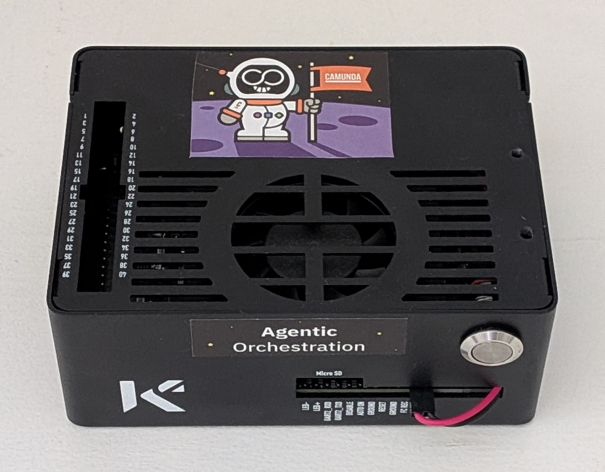

# 🏗️ Sovereign Infra

<div align="center">
  
  <p><i>Architecture Overview: Deterministic Orchestration meets Intelligent Execution.</i></p>
</div>

## 🛑 Role
*   This repository acts as the Sovereign Foundation layer (K3s/Helm/PostgreSQL), representing the dashed boundary in the Target Architecture. It provides the physical and virtual environment for the cluster-gitops layer. By using architecture-specific bootstrap scripts, it enforces strict resource boundaries and ensures 100% data sovereignty on-premises.

*   **Status:** 🚧 Work in Progress

### ⚙️ Resource-Aware Deployment Environments

| Environment | Specs (Tested)                  | Infrastructure Focus                                                       |
| :--- |:--------------------------------|:---------------------------------------------------------------------------|
| **High-Power Desktop** | 64 GB RAM / 16 GB VRAM (RTX)    | Full utilization for Heavy Load Testing, Large LLMs, Minikube with Web UI. |
| **Edge AI (Jetson)** | 8 GB Unified Memory (Orin Nano) | Strict RAM limits, Core Mode ArgoCD, Optimized Java Heap, K3s.             |
| **Minimal / Laptop** | 16 GB RAM (CPU only)            | Resource pooling for Proof of Concept & Local Testing, K3s.                |

### Infrastructure Guarantees
* Sovereignty: Local Kubernetes & RDBMS (PostgreSQL) without cloud leaks.
* Hardware Efficiency: Adaptive resource profiling (CPU/GPU/RAM) based on the selected bootstrap profile.

### Critical Constraints
* GPU Acceleration: Requires NVIDIA CUDA toolkit installation prior to cluster bootstrap.


## 🚀 Installation (Bootstrap)

- Preparation: Ensure a Linux OS with package manager apt-get is installed on your device. Verify `curl`, `git`, and (for GPU nodes) NVIDIA drivers are present.
- Execution: Download and execute the architecture-specific bootstrap script. This initializes K3s, injects ArgoCD Core Mode, and applies CPU/GPU constraints.

### x86_64 (Desktop)
```bash
chmod +x install-x64-desktop.sh
./install-x64-desktop.sh
```

🚧 Status: Planned


### Jetson / ARM64 (Edge Devices)



Deploying a lightweight Kubernetes cluster on the Jetson Orin Nano presents unique challenges related to container‑runtime compatibility, network configuration, and GPU integration. Detailed solutions are documented in the installation‑script comments.

| Step | Description                                                                | Key Challenges                                                                                                                                                |
|-------|----------------------------------------------------------------------------|---------------------------------------------------------------------------------------------------------------------------------------------------------------|
| 0     | Boot Configuration & Cgroups Check                                         | Missing cgroup parameters cause memory crashes; requires reboot.                                                                                              |                                                                                                                                                                                                                                  |
| 1     | Pre-Installation Checks                                                    | Verify Jetson hardware presence.                                                                                                                              |                                                                                                                                                                                                                                                                                   |
| 2     | Installing NVIDIA Container Runtime & Network Config (containerd, flannel) | CRI unblocking and preconfiguring CNI for a stable network; aligning container runtimes with system‑wide containerd + NVIDIA runtime.                         | 
| 3     | Installing K3s                                                             | None specific; standard K3s install using containerd endpoint.                                                                                                | 
| 4     | Enabling NVIDIA GPU Support in Kubernetes                                  | The Kubernetes resources for Nvidia Device Plugin fail on Jetson due to PCI‑based affinity and memory management issues, thus patches and enhancements are needed. | 
| 5     | Installing ArgoCD                                                          | Annotation limits for large manifests; requires server‑side apply.                                                                                            | 
| 6     | Resource Optimization                                                      | Minimizing log overhead and saving unified memory.                                                                                                            | 
| 7     | Verification                                                               | Final checks; ensure GPU registration and node allocatable resources.                                                                                         | 

```bash
chmod +x install-arm64-k3s.sh
./install-arm64-k3s.sh
```

🚀 Status: Tested


### x86_64 (Laptop)
```bash
chmod +x install-x64-laptop.sh
./install-x64-laptop.sh
```

🚧 Status: Planned

## 📄 License

This project is licensed under the MIT License - see the [LICENSE](LICENSE) file for details.